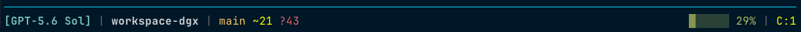
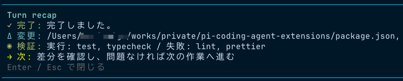

# Pi coding agent extensions

[English](README.md) | 日本語

[Pi coding agent](https://pi.dev/) を日常利用するために、自分が使っている小さな extension をまとめた Pi package です。

## 収録している extension

| extension       | 追加するもの                                                                                                                           |
| --------------- | -------------------------------------------------------------------------------------------------------------------------------------- |
| `focus-ui`      | 折りたたみ時の Bash 成功出力を隠し、エラーは表示したままにします。Footer はモデル、Git、コンテキスト使用率をまとめた表示へ置き換えます |
| `turn-recap`    | agent の処理が落ち着いた後に、作業要約、変更ファイル、検証コマンド、次の作業を短いウィンドウで表示します                               |
| `questionnaire` | 単一または複数の質問を、選択肢とタブ付きの TUI で確認する tool を追加します                                                            |
| `plan-mode`     | 読み取り専用の調査、plan ファイルの保存、実行中の進捗表示を追加します。TUI での確認には `questionnaire` を使います                     |

`questionnaire` と `plan-mode` の初期実装は `earendil-works/pi` の example を基にしています。帰属とライセンスは [THIRD_PARTY_NOTICES.md](THIRD_PARTY_NOTICES.md) に記載しました。このリポジトリの plan mode には、plan ファイルの保存と出力先の安全検査を追加しています。

## 表示例

### Focus UI Footer

利用中のモデル、作業ディレクトリ、Git の状態、コンテキスト使用率、compaction 回数を 1 行で確認できます。



### Turn Recap

agent の処理が落ち着いた後に、結果、変更ファイル、検証、次の作業を追加のモデル呼び出しなしで表示します。



## インストール

Pi package はユーザー権限でコードを実行します。インストール前にソースを確認してください。

```bash
pi install git:github.com/himorishige/pi-coding-agent-extensions
```

インストール後に Pi を再起動します。更新には次のコマンドを使います。

```bash
pi update --extensions
```

一部だけを読み込む場合は、`~/.pi/agent/settings.json` で package resource を絞れます。

```json
{
  "packages": [
    {
      "source": "git:github.com/himorishige/pi-coding-agent-extensions",
      "extensions": ["+extensions/focus-ui.ts", "+extensions/turn-recap.ts"]
    }
  ]
}
```

## 使い方

- `Ctrl+O` で tool 出力を展開できます。`focus-ui` の折りたたみ表示では Bash の成功出力を隠し、失敗したコマンドは表示します。
- `/recap on` と `/recap off` で、現在の session における recap 表示を切り替えます。
- `/plan` または `Ctrl+Alt+P` で plan mode を切り替えます。
- `/plan-save [relative-file.md]` で、既存の明示パスを上書きせずに plan を保存します。
- `/todos` で plan の進捗を表示します。

plan mode は操作ミスを減らすための guardrail であり、OS-level sandbox ではありません。Bash の shell control operator と既知の書き込み option は拒否しますが、残した read tool は Pi process が読めるファイルへアクセスできます。強い境界が必要な場合は permission rule または sandbox を併用してください。

plan の既定の保存先は `plans/{date}-{slug}.md` です。信頼済み project では `.pi/plan-mode.json` から変更できます。

```json
{
  "outputDirectory": "plans",
  "fileNamePattern": "{date}-{slug}.md"
}
```

## 対応バージョン

現在のバージョンは `@earendil-works/pi-coding-agent` 0.84.2 で検証しています。Pi の extension API は更新が速いため、Pi を更新するときはこのリポジトリの状況も確認してください。

## ライセンス

MIT License です。基にした upstream example については [THIRD_PARTY_NOTICES.md](THIRD_PARTY_NOTICES.md) を参照してください。
